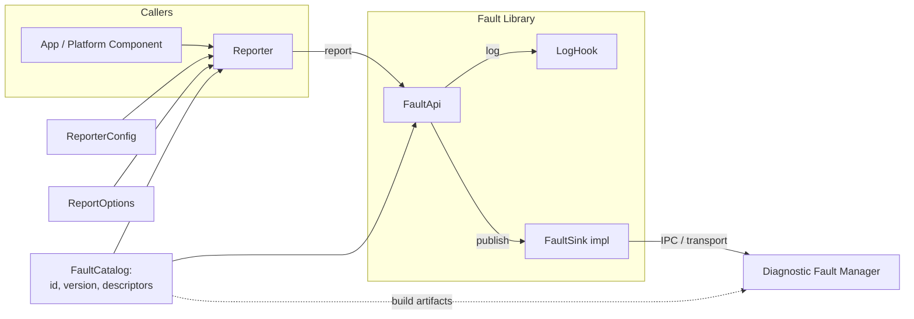

# Fault Library Design

The high-level design of OpenSOVD can be found here: [OpenSOVD Design](https://github.com/eclipse-opensovd/opensovd/blob/main/docs/design/design.md)

## High Level Requirements

- Provides a framework agnostic interface for apps or FEO activities to report faults - called "Fault API" in the S-CORE architecture.
- **The Fault lib is the interface between the S-CORE and the OpenSOVD project and should be developed in cooperation - see [ADR S-CORE Interface](https://github.com/eclipse-opensovd/opensovd/blob/main/docs/design/adr/001-adr-score-interface.md).**
- Relays faults via IPC to central Diagnostic Fault Manager.
- Enables domain-specific error logic (e.g. debouncing) by exposing a configuration interface.
- Reporting of faults additionally results in a log entry.
- The interface needs to be specified further but will likely include:
  - Fault ID (FID)
  - time
  - ENUM fault type (like DLT ENUMs)
  - optional meta data
- Fault lib is the base for activity specific, custom fault handling.
- Can and should also be used by platform components to report faults.
- Potentially source of faults to be acted upon - e.g. by S-CORE Health and Lifecycle Management.
- Also needs to enforce regulatory requirements for certain faults - e.g. emission relevant.
- Need to include: lifecycle stages, severity analog DLT levels, reset policy (e.g. power cycles), debounce policy, source identifyiers (entity, ecu, etc)
- Decentral component.
- The debouncing should be in the fault lib to reduce the traffic on the IPC.
- fault caching if IPC to DFM should not respond, with retry.
- support sync and async.
- Components must be able to create a fault-specific handle that binds the descriptor once and exposes simple raise/clear calls without passing the descriptor each time.

## Architecture Overview

## Rust API Draft

An example can be found here: [Example Component](../examples/hvac_component.rs)

This is the shape we’re aiming for:

- `FaultDescriptor` describes a fault once - ID, severity default, compliance flags, debounce/reset policy. Teams define these at build time and feed the same catalog to the DFM.
- `FaultCatalog` wraps that descriptor slice with an identifier and version so the DFM can sanity-check what each component is using.
- `FaultApi` owns a sink, a logger, and the catalog; `FaultApi::reporter` hands callers a cheap `Reporter` struct bound to their source metadata.
- `Reporter::report` merges descriptor defaults with any `ReportOptions` overrides, logs locally, and forwards the full picture (catalog id/version, effective policy decisions, merged compliance tags) to the sink. The sink’s only job is to get that payload to the DFM.
- Everything stays `Send + Sync` with no runtime dependencies, so the API fits anywhere from async executors to bare `no_std` targets once we feature-gate hooks (e.g. logging).

Practically, reporters are what components keep around; sinks are pluggable (e.g. S-CORE IPC); catalogs let tooling generate the same manifest for both sides, and the DFM remains the single place where debounce/reset evaluation happens.

## Design Decisions & Trade-offs

- **Catalog-driven manifests:** Fault identities and policies live in a build-time catalog instead of runtime registration. This keeps the ECU and DFM in sync and is easy to audit, but it means need of tooling to regenerate catalogs whenever descriptors change.
- **Declarative policies (no custom code hooks):** Components describe debounce/reset behaviour via enums and structs. That keeps the transport payload simple and lets the DFM enforce rules uniformly, at the cost of delaying support for custom logic.
- **Reporter-side metadata merge:** Each reporter starts with metadata defined in `ReporterConfig` (static keys like software version). Whenever `report()` is called, any extra key/value pairs supplied in `ReportOptions` get appended to that list, and the merged set is logged and forwarded. It means components can add per-event details on the fly, but they also have to keep an eye on payload size and consistent formatting.
- **Catalog version tagging in every record:** Each report carries `{catalog_id, catalog_version}` so the DFM can reject stale components. The extra bytes add overhead, but they make roll-back/roll-forward checks trivial.
- **Optional sink/log implementations:** No opinions on IPC or logging - must be integrated later.
