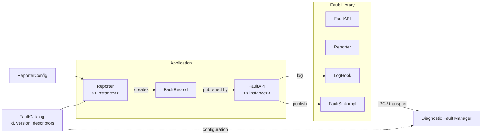
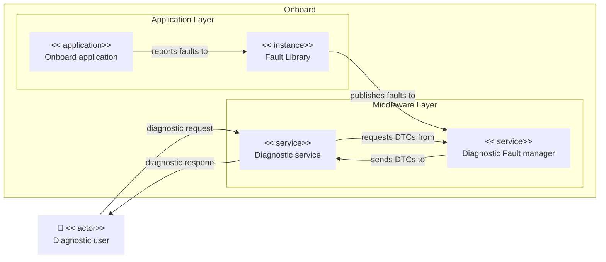

<!--
# *******************************************************************************
# Copyright (c) 2025 The Contributors to Eclipse OpenSOVD (see CONTRIBUTORS)
#
# See the NOTICE file(s) distributed with this work for additional
# information regarding copyright ownership.
#
# This program and the accompanying materials are made available under the
# terms of the Apache License Version 2.0 which is available at
# https://www.apache.org/licenses/LICENSE-2.0
#
# SPDX-FileCopyrightText: 2025 The Eclipse OpenSOVD contributors
# SPDX-License-Identifier: Apache-2.0
# *******************************************************************************
-->

# Fault Library Design

The high-level design of OpenSOVD can be found here: [OpenSOVD Design](https://github.com/eclipse-opensovd/opensovd/blob/main/docs/design/design.md)

## High Level Requirements

- Provides a framework agnostic interface for apps or FEO activities to report faults - called "Fault API" in the S-CORE architecture.
- **The Fault lib is the interface between the S-CORE and the OpenSOVD project and should be developed in cooperation - see [ADR S-CORE Interface](https://github.com/eclipse-opensovd/opensovd/blob/main/docs/design/adr/001-adr-score-interface.md).**
- Relays faults via IPC to central Diagnostic Fault Manager.
- Enables domain-specific error logic (e.g. debouncing) by exposing a configuration interface.
- Reporting of faults additionally results in a log entry.
- The interface needs to be specified further but will likely include:
  - Fault ID (FID)
  - time
  - ENUM fault type (like DLT ENUMs)
  - optional meta data
- Fault lib is the base for activity specific, custom fault handling.
- Can and should also be used by platform components to report faults.
- Potentially source of faults to be acted upon - e.g. by S-CORE Health and Lifecycle Management.
- Also needs to enforce regulatory requirements for certain faults - e.g. emission relevant.
- Need to include: lifecycle stages, severity analog DLT levels, reset policy (e.g. power cycles), debounce policy, source identifyiers (entity, ecu, etc)
- Decentral component.
- The debouncing should be in the fault lib to reduce the traffic on the IPC.
- fault caching if IPC to DFM should not respond, with retry.
- support sync and async.
- Components must be able to create a fault-specific handle that binds the descriptor once and exposes simple raise/clear calls without passing the descriptor each time.

## Architecture Overview

Use Case Diagram

## Rust API Draft

An example can be found here: [Example Component](../../tests/hvac_component.rs)

Here’s how a component ends up talking to the library:

1. Define a handful of `FaultDescriptor`s (the `fault_descriptor!` macro keeps them readable) and park them inside a `'static` `FaultCatalog { id, version, descriptors }`. Components still embed that slice at build time, while the DFM loads the same artifact through `FaultCatalog::from_config` so updates land via JSON/YAML config instead of rebuilding the manager.
2. Spin up a `FaultApi` with an `Arc<dyn FaultSink>` that knows how to reach the DFM and an `Arc<dyn LogHook>` that mirrors events into your logging stack.
3. Create a `Reporter` via `Reporter::new(ReporterConfig, Arc<FaultCatalog>)`. The config defines `SourceId`, lifecycle phase, and any default metadata; the catalog gives you descriptor lookups.
4. When something misbehaves, call `FaultRecord::new(&reporter, &FaultId)` to pull in the descriptor. Use the builder helpers—`.with_severity`, `.with_metadata`, `.with_debounce`, `.with_reset`, `.with_extra_compliance`, `.with_stage`—to tweak the record for that incident and set the lifecycle state (`Active`, `NotSet`, `TestedAndPassed`, etc.).
5. Hand the record to `FaultApi::publish(&record)`. It logs first, then pushes the payload through the sink and returns a `Result<(), SinkError>` so callers can react to transport failures.

Each `FaultRecord` carries the descriptor snapshot, catalog id/version, effective policies, merged compliance tags, the chosen lifecycle stage, and any metadata the DFM needs. The whole stack stays `Send + Sync` with zero external dependencies, so it fits into async executors or bare tasks. We expect to add a convenience layer around `ReportOptions` once more components start using it.

## Design Decisions & Trade-offs

- **Static catalogs + runtime config:** Components still ship `'static` descriptors for zero-cost lookup, while the DFM consumes the same artifact via `FaultCatalog::from_config` so policy changes land via JSON/YAML config instead of a rebuild. This keeps deployment fast with only a light runtime copy cost on the DFM side.
- **Self-contained records:** `FaultRecord::new` clones the descriptor so every record is safe to queue, persist, or retry. The trade-off is a bit of extra copy/alloc cost if descriptors grow large.
- **Explicit lifecycle states:** `FaultLifecycleStage` now covers `NotSet` through `TestedAndPassed`, so consumers can tell whether a diagnostic test ran even when no fault is active; callers opt in via `FaultRecord::with_stage`.
- **Synchronous publish path:** `FaultApi::publish` always logs first, then calls the sink on the same thread. Control loops stay simple, yet any sink that blocks on I/O will want to hand work to another task or future.
- **Declarative policies:** Debounce and reset logic ride on enums (`DebounceMode`, `ResetTrigger`). The DFM can enforce them consistently, but custom one-off algorithms need new variants or a different layer.
- **Panic on missing descriptors:** If a caller asks for a fault that isn’t in the catalog we `expect(...)` and crash. That flushes out drift early, so production flows should generate the catalog and component code together.
